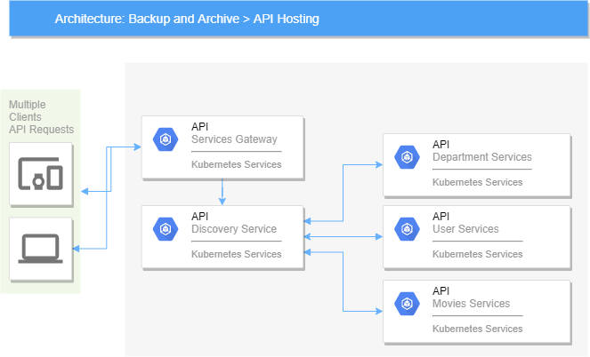

> Note: use JVM args "--add-opens java.base/java.lang.invoke=ALL-UNNAMED" to run the DepartmentServices workaround for the issue with open feign mentioned in this [bug#935](https://github.com/OpenFeign/feign/issues/935)

# spring-cloud
Starter project for spring-cloud
## Technologies
- Java 11
- Spring Cloud
- Docker
- Kubernetes
## Cloud Starters Used
- spring-cloud-starter-netflix-eureka-service
- spring-cloud-starter-netflix-eureka-client
- spring-cloud-starter-openfeign
- spring-cloud-starter-sleuth
- spring-cloud-starter-gateway
## Regular Dependencies
- micrometer-registry-prometheus
- spring-boot-starter-data-jpa
- hibernate-core

## Archetecture

